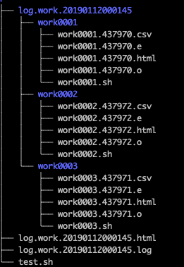
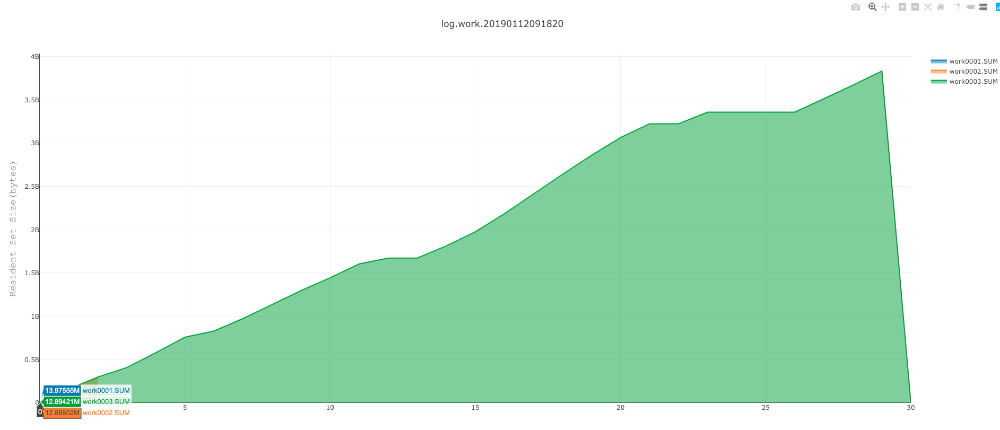

# Welcome to Animal-Courier


This is for shell scripts run in parallel.

## Install

### Conda(recommend)

```bash
conda install -r btrspg animal-courier
```

### Manual

```bash
wget https://github.com/dota2-BioTools/Animal-Courier/archive/v0.1.4.alpha.tar.gz
tar -zxvf v0.1.4.alpha.tar.gz
cd v0.1.4.alpha
python setup.py install
```

or install the development

```bash
pip install git+https://github.com/dota2-BioTools/Animal-Courier.git
```
### Usage

```bash
multi_run.py -h

optional arguments:
  -h, --help            show this help message and exit
  --shell SHELL         shell scripts (default: None)
  --thread THREAD       thread number (default: 4)
  --work-name WORK_NAME
                        logs name prefix (default: work)
  --profile             If run profile for command(only RSS) (default: False)
  --interval INTERVAL   If profile set True, please set interval(seconds) of
                        the memory stats (default: 10)
```

#### shell

This is a shell script. Every line in the script is a complete command.

For example, a script like this:
```bash
#bwa mem test1.1.fq.gz test1.2.fq.gz reference.fasta | samtools view -bSt reference.fasta.fai -o test1.bam
# this one would not be identify as a complete command. It would not run.
bwa mem test1.1.fq.gz test1.2.fq.gz reference.fasta | samtools view -bSt reference.fasta.fai -o test1.bam
bwa mem test2.1.fq.gz test2.2.fq.gz reference.fasta | samtools view -bSt reference.fasta.fai -o test2.bam
bwa mem test3.1.fq.gz test3.2.fq.gz reference.fasta | samtools view -bSt reference.fasta.fai -o test3.bam
```

#### thread

How many workers to run the scripts.

#### work-name

Every command line would generate a separate shell script. As mention above, there would be three shell scripts named:

- work.0001.sh
```bash
#! /bin/bash
bwa mem test1.1.fq.gz test1.2.fq.gz reference.fasta | samtools view -bSt reference.fasta.fai -o test1.bam
```
- work.0002.sh
```bash
#! /bin/bash
bwa mem test2.1.fq.gz test2.2.fq.gz reference.fasta | samtools view -bSt reference.fasta.fai -o test2.bam
```
and work.0003.sh


#### profile

tofill

#### interval

tofill

## Example


- test.sh
```bash
perl -e 'for($i=0;$i<200000;$i++){$hash{$i}=$i;}'
perl -e 'for($i=0;$i<2000000;$i++){$hash{$i}=$i;}'
perl -e 'for($i=0;$i<20000000;$i++){$hash{$i}=$i;}'
```

```bash
multi_run.py --shell test.sh --thread 4 --profile --interval 1
```

### Results

- standard out
```bash
2019-01-12 00:01:46,004 multi_run.py [INFO] Get command args, and args are :test.sh
2019-01-12 00:01:46,343 psopen.py [INFO] now workon 437972:work0002...
2019-01-12 00:01:46,343 psopen.py [INFO] now workon 437970:work0001...
2019-01-12 00:01:46,343 psopen.py [INFO] now workon 437971:work0003...
2019-01-12 00:02:02,711 psopen.py [INFO] finished 437972:work0002...
2019-01-12 00:02:02,736 psopen.py [INFO] finished 437970:work0001...
2019-01-12 00:02:21,234 psopen.py [INFO] finished 437971:work0003...
2019-01-12 00:02:21,291 multi_run.py [INFO] Stats time of work
2019-01-12 00:02:21,296 multi_run.py [INFO] Stats profiles
2019-01-12 00:02:26,182 multi_run.py [INFO] ALL FINISHED!!
============================================================
  Time(mins)      Work                                            Profile
0       0.27  work0001  ./log.work.20190112000145/work0001//work0001.4...
1       0.27  work0002  ./log.work.20190112000145/work0002//work0002.4...
2       0.58  work0003  ./log.work.20190112000145/work0003//work0003.4...
============================================================
count    3.000000
mean     0.373333
std      0.178979
min      0.270000
25%      0.270000
50%      0.270000
75%      0.425000
max      0.580000
```

- structure



- log

[](html/log.work.20190112091820.html)
