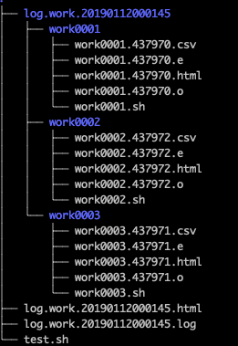
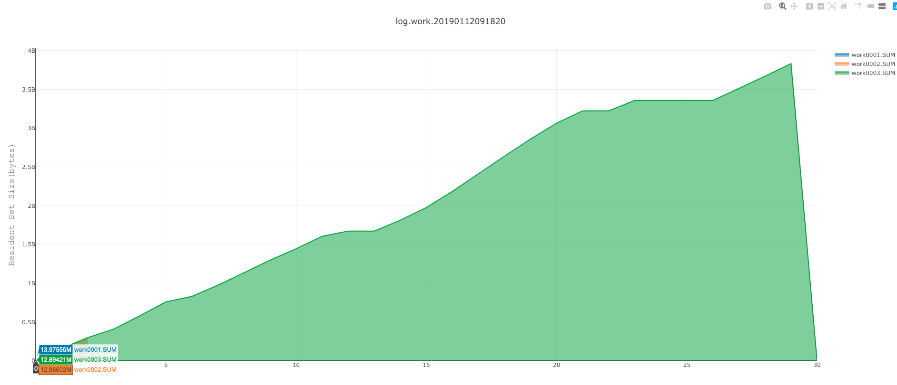

# 欢迎来到 Animal-Courier

[](https://github.com/dota2-BioTools/Animal-Courier/blob/master/LICENSE)


[](https://anaconda.org/btrspg/animal-courier)
[](https://anaconda.org/btrspg/animal-courier)
[](https://codecov.io/gh/dota2-BioTools/Animal-Courier)


这只是一个脚本并行控制程序。适用于什么样的情况呢？举两个例子：

1. 本地运行耗时较长，资源消耗一般，但数量较多的情况

>这就好比，我想在本地运行`bwa`来进行比对，而我已知`bwa`比对可能用到的资源大概是本机的五分之一，所以我觉得我可以并行，而且并行4个是肯定没有问题。但是
我又有50个样本需要跑，当然就比较希望能够同时跑4个，直到50个样本都比对完。（一般脚本需要用for一个一个跑，就是同时只能跑一个；或者全部用nohup投递到
后台，但同时跑50个机器又受不了）

2. 想要大概估计一下某些脚本的资源消耗（目前只支持RSS）

>比如，RNA-seq数据比对有那么多软件，那么哪种比较适合自己的机器运行（考虑的因素应该很多，但是现在只是想看看她们的运行时间及内存消耗情况，看看哪种更
适合），就可以适用本程序的`--profile`来进行统计，同时给出可视化结果，方便查看。

## 安装

### Conda(推荐)

```bash
conda install -r btrspg animal-courier
```

### 手动安装

```bash
wget https://github.com/dota2-BioTools/Animal-Courier/archive/v0.1.4.alpha.tar.gz
tar -zxvf v0.1.4.alpha.tar.gz
cd v0.1.4.alpha
python setup.py install
```

or install the development

```bash
pip install git+https://github.com/dota2-BioTools/Animal-Courier.git
```
### 使用方法

```bash
multi_run.py -h

optional arguments:
  -h, --help            show this help message and exit
  --shell SHELL         shell scripts (default: None)
  --thread THREAD       thread number (default: 4)
  --work-name WORK_NAME
                        logs name prefix (default: work)
  --profile             If run profile for command(only RSS) (default: False)
  --interval INTERVAL   If profile set True, please set interval(seconds) of
                        the memory stats (default: 10)
```

#### shell

想要进行并行运行的脚本，一行一个完整脚本，具体例子如下：
```bash
#bwa mem test1.1.fq.gz test1.2.fq.gz reference.fasta | samtools view -bSt reference.fasta.fai -o test1.bam
# this one would not be identify as a complete command. It would not run.
bwa mem test1.1.fq.gz test1.2.fq.gz reference.fasta | samtools view -bSt reference.fasta.fai -o test1.bam
bwa mem test2.1.fq.gz test2.2.fq.gz reference.fasta | samtools view -bSt reference.fasta.fai -o test2.bam
bwa mem test3.1.fq.gz test3.2.fq.gz reference.fasta | samtools view -bSt reference.fasta.fai -o test3.bam
```
- #注释的不会当作命令
- 假设需要运行多个步骤的，推荐适用`;`进行连接

```bash
bwa mem test1.1.fq.gz test1.2.fq.gz reference.fasta | samtools view -bSt reference.fasta.fai -o test1.bam;samtools index test1.bam
```


#### thread

同时运行任务数目，默认为4个。

#### work-name

每行命令都会重新分割成单独的`shell`脚本，这个脚本会以`work-name`为前缀，并且整个脚本完整log也会以`work-name`为前缀。默认：`work`
例如上面例子中的test.sh就会被拆分为如下几个脚本：

- work.0001.sh
```bash
#! /bin/bash
bwa mem test1.1.fq.gz test1.2.fq.gz reference.fasta | samtools view -bSt reference.fasta.fai -o test1.bam
```
- work.0002.sh
```bash
#! /bin/bash
bwa mem test2.1.fq.gz test2.2.fq.gz reference.fasta | samtools view -bSt reference.fasta.fai -o test2.bam
```
- work.0003.sh

```bash
#! /bin/bash
bwa mem test3.1.fq.gz test3.2.fq.gz reference.fasta | samtools view -bSt reference.fasta.fai -o test3.bam
```


#### profile

是否需要进行内存统计，默认不进行统计。

#### interval

内存统计间隔时间，如果开启`profile`参数，则默认时间间隔为10秒。根据运行脚本合理设置间隔时间。

## 例子


- test.sh
```bash
perl -e 'for($i=0;$i<200000;$i++){$hash{$i}=$i;}'
perl -e 'for($i=0;$i<2000000;$i++){$hash{$i}=$i;}'
perl -e 'for($i=0;$i<20000000;$i++){$hash{$i}=$i;}'
```

```bash
multi_run.py --shell test.sh --thread 4 --profile --interval 1
```

### 结果

- standard out
```bash
2019-01-12 00:01:46,004 multi_run.py [INFO] Get command args, and args are :test.sh
2019-01-12 00:01:46,343 psopen.py [INFO] now workon 437972:work0002...
2019-01-12 00:01:46,343 psopen.py [INFO] now workon 437970:work0001...
2019-01-12 00:01:46,343 psopen.py [INFO] now workon 437971:work0003...
2019-01-12 00:02:02,711 psopen.py [INFO] finished 437972:work0002...
2019-01-12 00:02:02,736 psopen.py [INFO] finished 437970:work0001...
2019-01-12 00:02:21,234 psopen.py [INFO] finished 437971:work0003...
2019-01-12 00:02:21,291 multi_run.py [INFO] Stats time of work
2019-01-12 00:02:21,296 multi_run.py [INFO] Stats profiles
2019-01-12 00:02:26,182 multi_run.py [INFO] ALL FINISHED!!
============================================================
  Time(mins)      Work                                            Profile
0       0.27  work0001  ./log.work.20190112000145/work0001//work0001.4...
1       0.27  work0002  ./log.work.20190112000145/work0002//work0002.4...
2       0.58  work0003  ./log.work.20190112000145/work0003//work0003.4...
============================================================
count    3.000000
mean     0.373333
std      0.178979
min      0.270000
25%      0.270000
50%      0.270000
75%      0.425000
max      0.580000
```

- 最终生成的log的目录结构



- 开启`profile`参数后，进行的内存统计结果（点击图片可交互）

[](html/log.work.20190112091820.html)
